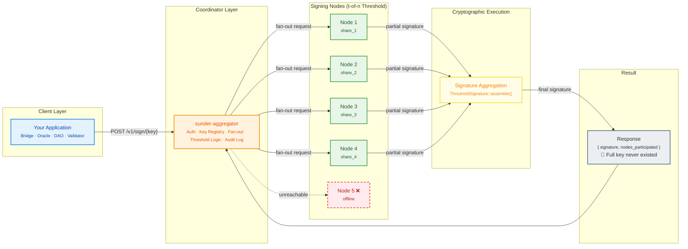

# Sunder

**Self-hosted threshold signing infrastructure.**  
The key is split. It never comes back together.

> 📊 **[Pitch Deck](https://docs.google.com/presentation/d/1Hm575VoYnOfTAo0Y2qwCit9xqyDP5z7G1SMIdpEUkiY/edit?usp=sharing)** · 🎥 **[Demo Video](https://drive.google.com/file/d/17k8N2s5_oqzNQxdvj6gI88pHF6cqAR83/view?usp=sharing)**

---

## What is Sunder?

Sunder is a production-ready service layer on top of [Thetacrypt](https://github.com/cryptobern/thetacrypt) — an IC3 research library implementing BLS04, FROST, and other threshold cryptographic schemes in Rust.

When a message is signed through Sunder:

- No single node ever holds the complete private key
- T nodes each contribute a **partial signature** from their key share
- The aggregator combines them into one valid threshold signature
- Compromise one node → you learn nothing about the key
- Take down `N - T` nodes → signing still works

## Architecture
This visual diagram depicting Sunder's layered system components work (showing how Sunder signing system works)



<!-- <p align="center">
  
</p> -->

## Project Structure

Sunder is organized as a modular, multi-crate Rust workspace designed for distributed threshold signing.

```
sunder/
├── crates/
│   ├── sunder-core/        # Shared types, errors, audit log
│   ├── sunder-node/        # Signing node — holds one key share
│   ├── sunder-aggregator/  # Fan-out, collect, assemble
│   └── sunder-cli/         # Operator CLI
├── sdk/
│   └── sunder-client/      # Rust SDK for application integration
├── docker/
│   ├── Dockerfile.node
│   ├── Dockerfile.aggregator
│   └── docker-compose.yml
└── scripts/
    ├── setup.sh            # One-time key generation
    └── demo.sh             # Fault tolerance demo
```

---

## Quickstart
 
### 1. Prerequisites
 
- Docker and Docker Compose installed and running
- Rust toolchain (`curl https://sh.rustup.rs -sSf | sh`)
- Git
 
### 2. Clone Sunder
 
```bash
git clone https://github.com/dicethedev/sunder
cd sunder
```
 
Sunder fetches Thetacrypt automatically via Cargo — no manual cloning needed.
 
### 3. Build the Thetacrypt Docker image
 
Sunder uses Thetacrypt's tooling to generate key shares. Build the image once:
 
```bash
# Clone thetacrypt alongside Sunder
cd ..
git clone https://github.com/dicethedev/thetacrypt
cd thetacrypt/demo
 
# Fix known compatibility issues with modern Rust/Docker
sed -i 's/FROM rust:.*/FROM rust:latest as builder/' Dockerfile
sed -i 's/FROM debian:12.*/FROM debian:trixie-slim/' Dockerfile
sed -i 's/RUN cargo build --release/RUN RUSTFLAGS="--allow dangerous_implicit_autorefs --allow legacy_derive_helpers" cargo build --release/' Dockerfile
sed -i 's/docker-compose/docker compose/g' Makefile
 
make set-up
make build-docker
```
 
> **Why these fixes?** Thetacrypt was written against Rust 1.74. Running it in 2026
> requires bumping the base image and suppressing two lint errors that became
> hard errors in newer Rust. These are one-time setup steps.
 
### 4. Generate key shares
 
Back in the Sunder directory:
 
```bash
cd ../../sunder
chmod +x scripts/setup.sh
./scripts/setup.sh
```
 
This runs Thetacrypt's `thetacli keygen` inside Docker and generates a
**3-of-5 BLS04 threshold key** — 5 key shares distributed across `config/`,
one per node. The complete private key is never assembled.
 
Expected output:
 
```
✅ Key shares generated
✅ Server configs generated
✅ Setup complete!
```
 
### 5. Build Sunder
 
```bash
RUSTFLAGS="--allow dangerous_implicit_autorefs --allow legacy_derive_helpers" \
  cargo build --release
```
 
### 6. Start the cluster
 
```bash
cd docker
docker compose up -d
```
 
This starts:
- 5 signing nodes (each holds one key share)
- 1 aggregator (public-facing API, holds only the public key)
 
Confirm all 6 containers are running:
 
```bash
docker compose ps
```
 
Expected output:
 
```
NAME                 STATUS
sunder-aggregator    running
sunder-node1         running
sunder-node2         running
sunder-node3         running
sunder-node4         running
sunder-node5         running
```
 
---
 
## Using Sunder
 
### Check cluster health
 
```bash
curl http://localhost:8080/health
```
 
Response:
 
```json
{ "status": "ok", "keys_loaded": 1 }
```
 
### List available keys
 
```bash
curl http://localhost:8080/v1/keys
```
 
Response:
 
```json
[{ "name": "abc123...", "scheme": "Bls04", "threshold": 3, "share_id": 0 }]
```
 
Copy the `name` value — this is your `<key-id>` for all signing operations.
 
### Sign a message
 
Messages must be hex-encoded bytes.
 
```bash
# "hello sunder" in hex
curl -s -X POST http://localhost:8080/v1/sign/<key-id> \
  -H "Content-Type: application/json" \
  -d '{"message": "68656c6c6f2073756e646572"}' | jq .
```
 
Response:
 
```json
{
  "key_name": "abc123...",
  "signature": "9f3a2c...",
  "nodes_participated": [1, 2, 3]
}
```
 
The full private key was never held by any single process. Each of nodes 1, 2,
and 3 computed a partial signature from their individual share. The aggregator
combined the three partial signatures into this final result.
 
### Verify a signature
 
```bash
curl -s -X POST http://localhost:8080/v1/verify \
  -H "Content-Type: application/json" \
  -d '{
    "key_name": "<key-id>",
    "signature": "<signature-from-sign>",
    "message": "68656c6c6f2073756e646572"
  }' | jq .
```
 
Response:
 
```json
{ "valid": true }
```
 
---
 
## Fault Tolerance
 
This is the core guarantee of threshold signing — the cluster keeps signing
even when nodes go offline or are compromised.
 
### Stop a node and observe
 
```bash
# Check current state — all 5 nodes healthy
docker compose ps
 
# Stop node 4
docker stop sunder-node4
```
 
Sign again — the aggregator automatically routes around the missing node:
 
```bash
curl -s -X POST http://localhost:8080/v1/sign/<key-id> \
  -H "Content-Type: application/json" \
  -d '{"message": "68656c6c6f2073756e646572"}' | jq .
```
 
Response — notice node 4 is absent:
 
```json
{
  "key_name": "abc123...",
  "signature": "a2f8e9...",
  "nodes_participated": [1, 2, 3]
}
```
 
The signature is still valid. The public key hasn't changed. The threshold
(3-of-5) is still met by the remaining nodes.
 
### Stop two nodes — still works
 
```bash
docker stop sunder-node4 sunder-node5
 
# Signing with only 3 nodes — exactly at the threshold
curl -s -X POST http://localhost:8080/v1/sign/<key-id> \
  -H "Content-Type: application/json" \
  -d '{"message": "68656c6c6f2073756e646572"}' | jq .
```
 
Signing still succeeds with nodes 1, 2, and 3.
 
### Stop three nodes — signing fails (by design)
 
```bash
docker stop sunder-node3 sunder-node4 sunder-node5
 
# Now only 2 nodes remain — below the threshold of 3
curl -s -X POST http://localhost:8080/v1/sign/<key-id> \
  -H "Content-Type: application/json" \
  -d '{"message": "68656c6c6f2073756e646572"}' | jq .
```
 
Response:
 
```json
"not enough partial signatures: need 3, got 2"
```
 
This is correct and expected. The system refuses to sign rather than
compromising the security model. Bring a node back and signing resumes:
 
```bash
docker start sunder-node3
 
# Works again
curl -s -X POST http://localhost:8080/v1/sign/<key-id> \
  -H "Content-Type: application/json" \
  -d '{"message": "68656c6c6f2073756e646572"}' | jq .
```
 
### Restart all nodes
 
```bash
docker start sunder-node3 sunder-node4 sunder-node5
docker compose ps
```
 
---
 
## Run the demo
 
The demo script runs the full fault tolerance scenario automatically:
 
```bash
chmod +x scripts/demo.sh
./scripts/demo.sh
```
 
What it demonstrates:
 
1. Health check across all 5 nodes
2. Signs a message — 3 nodes participate
3. Verifies the signature
4. **Kills 2 nodes** — signing still succeeds with the remaining 3
5. Verifies the new signature is also valid
6. Brings the killed nodes back online
 
The key insight: the same public key verifies both signatures.
The complete private key was never assembled either time.
 
---
 
## Stop the cluster
 
```bash
# Stop all containers (keeps config and logs)
cd docker
docker compose down
 
# Stop and remove volumes (full clean slate)
docker compose down -v
```
 
---
 
## CLI
 
```bash
# Build the CLI
cargo build --release -p sunder-cli
 
# Sign
./target/release/sunder sign --key <key-id> --message 68656c6c6f
 
# Verify
./target/release/sunder verify \
  --key <key-id> \
  --sig <hex> \
  --message 68656c6c6f
 
# List keys
./target/release/sunder keys
 
# Health check
./target/release/sunder health
```
 
---
 
## SDK
 
```rust
use sunder_client::SunderClient;
 
#[tokio::main]
async fn main() {
    let client = SunderClient::new("http://localhost:8080");
 
    // Two lines to sign
    let result = client.sign("bridge-signer", b"approve_withdrawal_4821").await.unwrap();
 
    println!("signature: {}", result.signature);
    println!("nodes:     {:?}", result.nodes_participated);
}
```

---
 
## API Reference
 
### `GET /health`
 
Returns aggregator health and number of loaded keys.
 
### `GET /v1/keys`
 
Lists all threshold keys available for signing.
 
### `POST /v1/sign/:key_name`
 
```json
{ "message": "<hex-encoded bytes>" }
```
 
Returns:
 
```json
{
  "key_name": "string",
  "signature": "<hex>",
  "nodes_participated": [1, 2, 3]
}
```
 
### `POST /v1/verify`
 
```json
{
  "key_name": "string",
  "signature": "<hex>",
  "message": "<hex>"
}
```
 
Returns:
 
```json
{ "valid": true }
```
---

### The cryptographic path

```
POST /v1/sign/my-key
  → aggregator fans out to N nodes
    → each node: ThresholdSignature::partial_sign(msg, label, &key_share, &mut params)
    → returns SignatureShare (ASN.1 serialized, hex over HTTP)
  → aggregator collects T shares
  → ThresholdSignature::assemble(&shares, msg, &pubkey) → Signature
  → returns hex-encoded Signature
```

All cryptographic operations are provided by **Thetacrypt** (IC3 research).  
Sunder provides the service layer: HTTP API, deployment, auth, audit logging.

---

## Trust Model

**What Sunder guarantees:**
- The complete signing key never exists in full — not at setup, not during signing
- Compromising `T - 1` nodes reveals no information about the key
- The cluster continues signing if up to `N - T` nodes are offline or compromised

**What Sunder does NOT guarantee (v0.1):**
- Byzantine-fault-tolerant aggregation — the aggregator is trusted
- Distributed Key Generation — keys are generated by a trusted dealer (thetacrypt's `thetacli keygen`)
- Encrypted channels between nodes — signing messages are not sensitive; key shares are distributed offline at setup

These are documented limitations, not bugs. DKG and proactive share refresh are on the roadmap.

---

## Built at

Shape Rotator Virtual Hackathon 2026  
Track: Cryptographic Primitives  
Built on: [Thetacrypt](https://github.com/cryptobern/thetacrypt) by IC3
